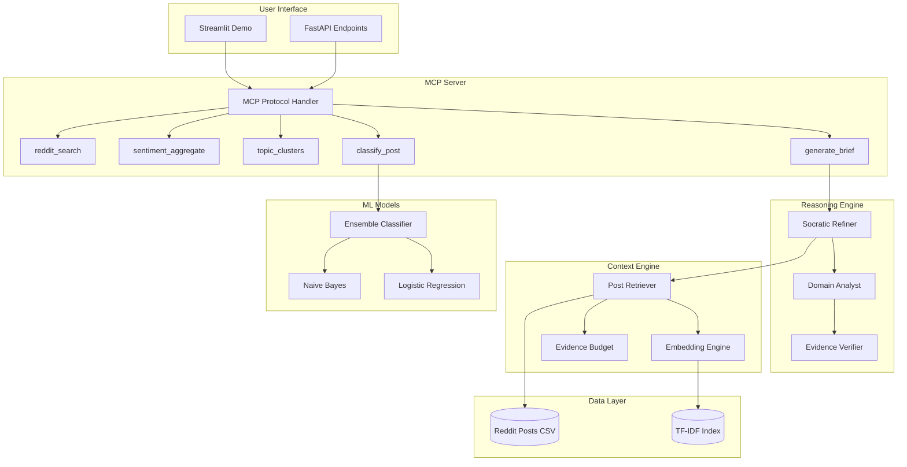

# 🔍 CryptoSentinel

**Agentic AI System for Grounded Crypto & Stock Market Intelligence**

[](https://www.python.org/downloads/)
[](https://opensource.org/licenses/MIT)
[](https://modelcontextprotocol.io/)

CryptoSentinel transforms Reddit discussions from r/wallstreetbets and r/CryptoMoonShots into actionable, **grounded** intelligence. Unlike traditional chatbots that may hallucinate, CryptoSentinel implements a **Self-Socratic Refinement** loop that ensures every insight is backed by evidence with proper citations.

## 🎯 Key Features

- **MCP-Compatible Tools** - Expose analysis capabilities to any AI assistant via the Model Context Protocol
- **Self-Socratic Refinement** - Plan → Execute → Verify → Finalize reasoning loop
- **Dual-Persona Verification** - DomainAnalyst + EvidenceVerifier work together to prevent hallucination
- **Evidence Budgeting** - Minimum citation requirements for grounded claims
- **93% Classification Accuracy** - Ensemble NB+LR model distinguishes crypto from stock discussions
- **Interactive Demo** - Streamlit UI with full reasoning trace visualization

## 🏗️ Architecture



## 🛠️ MCP Tools

CryptoSentinel exposes 5 tools via the Model Context Protocol:

| Tool | Description |
|------|-------------|
| `reddit_search` | Search posts with filters (subreddit, time, score) |
| `sentiment_aggregate` | Aggregate sentiment for a topic across posts |
| `topic_clusters` | Extract main discussion themes |
| `classify_post` | Classify content as crypto or stocks |
| `generate_brief` | Generate grounded narrative with citations |

### Example Tool Usage

```python
from src.mcp_server.tools import generate_brief

brief = generate_brief(
    topic="What are people saying about Bitcoin?",
    max_sources=5
)

print(f"Summary: {brief.summary}")
print(f"Confidence: {brief.confidence:.1%}")
print(f"Groundedness: {brief.groundedness}")
for citation in brief.citations:
    print(f"  - [{citation.subreddit}]({citation.url})")
```

## 🧠 Self-Socratic Refinement

The reasoning engine follows a structured loop to ensure grounded responses:

```
┌─────────────────────────────────────────────────────────────┐
│                    SELF-SOCRATIC LOOP                        │
├─────────────────────────────────────────────────────────────┤
│                                                              │
│  1. PLAN                                                     │
│     └─ Decompose question into sub-questions                 │
│     └─ Identify required tools                               │
│     └─ Estimate evidence needs                               │
│                                                              │
│  2. EXECUTE                                                  │
│     └─ Call tools to gather evidence                         │
│     └─ Collect citations with relevance scores               │
│     └─ Track evidence budget                                 │
│                                                              │
│  3. VERIFY                                                   │
│     └─ Domain Analyst: Generate insights                     │
│     └─ Evidence Verifier: Check citations                    │
│     └─ Identify gaps and contradictions                      │
│     └─ Apply VETO if standards not met                       │
│                                                              │
│  4. FINALIZE                                                 │
│     └─ Produce grounded answer OR                            │
│     └─ REFUSE with explanation                               │
│                                                              │
└─────────────────────────────────────────────────────────────┘
```

## 📊 Original Research Foundation

This project builds on NLP research analyzing ~5,500 Reddit posts:

| Metric | Value |
|--------|-------|
| **Dataset Size** | 5,545 posts |
| **Sources** | r/wallstreetbets, r/CryptoMoonShots |
| **Classification Accuracy** | 93.0% |
| **Ensemble Model** | Naive Bayes + Logistic Regression |
| **Vectorization** | TF-IDF with unigrams |
| **Sentiment Analysis** | VADER |

## 🚀 Quick Start

### Installation

```bash
# Clone the repository
git clone https://github.com/yourusername/cryptosentinel.git
cd cryptosentinel

# Install dependencies
pip install -r requirements.txt

# Download NLTK data
python -c "import nltk; nltk.download('punkt'); nltk.download('stopwords'); nltk.download('wordnet')"
```

### Run the Demo

```bash
# Streamlit UI
streamlit run app/streamlit_app.py

# Or FastAPI server
uvicorn app.api:app --reload --port 8000
```

### Use as MCP Server

Add to your Claude Desktop config (`claude_desktop_config.json`):

```json
{
  "mcpServers": {
    "cryptosentinel": {
      "command": "python",
      "args": ["-m", "src.mcp_server.server"],
      "cwd": "/path/to/cryptosentinel"
    }
  }
}
```

## 📈 Reliability Metrics

CryptoSentinel includes an evaluation suite to measure reliability:

### Groundedness Evaluation
- Tests that claims have supporting citations
- Measures citation relevance thresholds
- Validates groundedness labels

### Refusal Evaluation
- Tests proper refusal on insufficient evidence
- Measures false positive/negative rates
- Validates refusal explanations

```bash
# Run evaluations
python -m evals.groundedness
python -m evals.refusal
```

## 🔧 API Reference

### REST Endpoints

| Endpoint | Method | Description |
|----------|--------|-------------|
| `/health` | GET | Health check |
| `/search` | POST | Search Reddit posts |
| `/sentiment` | POST | Sentiment aggregation |
| `/classify` | POST | Post classification |
| `/brief` | POST | Generate grounded brief |
| `/reason` | POST | Full Socratic reasoning |
| `/clusters` | GET | Topic clusters |
| `/tools` | GET | MCP tool definitions |

### Example API Call

```bash
curl -X POST "http://localhost:8000/brief" \
  -H "Content-Type: application/json" \
  -d '{"topic": "Bitcoin sentiment", "max_sources": 5}'
```

## 📁 Project Structure

```
crypto-stocks-nlp/
├── src/
│   ├── context_engine/     # Semantic search & evidence
│   │   ├── retriever.py    # Post retrieval with citations
│   │   ├── embeddings.py   # TF-IDF/transformer embeddings
│   │   └── evidence.py     # Evidence budget & validation
│   ├── mcp_server/         # MCP protocol implementation
│   │   ├── server.py       # JSON-RPC server
│   │   └── tools.py        # Tool definitions
│   ├── reasoning/          # Agentic reasoning
│   │   ├── socratic_refine.py  # Plan-Execute-Verify-Finalize
│   │   └── personas.py     # Analyst + Verifier personas
│   ├── models/             # ML classifiers
│   │   └── classifier.py   # Ensemble NB+LR
│   └── utils/              # Utilities
│       └── preprocessing.py # NLTK text processing
├── app/
│   ├── streamlit_app.py    # Interactive demo UI
│   └── api.py              # FastAPI endpoints
├── evals/
│   ├── groundedness.py     # Citation accuracy tests
│   └── refusal.py          # Proper refusal tests
├── data/                   # Reddit post CSVs
├── code/                   # Original notebooks
├── requirements.txt
├── pyproject.toml
└── AGENTS.md               # Development guidance
```

## 🔒 Safety & Limitations

### What CryptoSentinel Does
- ✅ Provides grounded analysis backed by citations
- ✅ Clearly labels speculation vs. grounded claims
- ✅ Refuses to answer when evidence is insufficient
- ✅ Tracks confidence and groundedness scores

### What CryptoSentinel Does NOT Do
- ❌ Provide financial advice
- ❌ Make price predictions
- ❌ Guarantee accuracy of Reddit posts
- ❌ Access real-time data (uses historical dataset)

## 📚 References

1. Reddit API Documentation - [reddit.com/dev/api](https://www.reddit.com/dev/api/)
2. Python Reddit API Wrapper (PRAW) - [praw.readthedocs.io](https://praw.readthedocs.io/)
3. Model Context Protocol - [modelcontextprotocol.io](https://modelcontextprotocol.io/)
4. NLTK - Bird, Klein, & Loper (2009). Natural Language Processing with Python
5. Scikit-learn - Pedregosa et al., JMLR 12, pp. 2825-2830, 2011

## 📄 License

MIT License - See [LICENSE](LICENSE) for details.

---

**Built with ❤️ for grounded, reliable AI analysis of financial discussions.**
